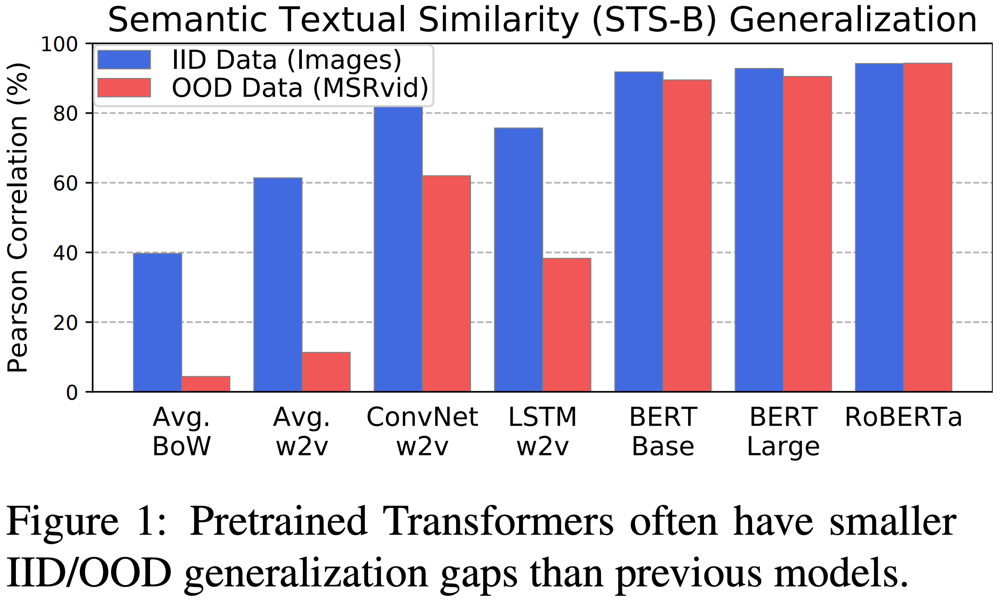

# Pretrained Transformers Improve Out-of-Distribution Robustness

How does pretraining affect out-of-distribution robustness? We create an OOD benchmark and use it to show that pretrained transformers such as BERT have substantially higher OOD accuracy and OOD detection rates compared to traditional NLP models.

This repository most of the code for the paper [_Pretrained Transformers Improve Out-of-Distribution Robustness_](https://arxiv.org/abs/2004.06100), ACL 2020.

Requires Python 3+ and PyTorch 1.0+.

To correctly use RoBERTa model, see `allennlp_glue_patch/notes.py`.

## Citation

If you find this useful in your research, please consider citing:

    @inproceedings{hendrycks2020pretrained,
        Author = {Dan Hendrycks and Xiaoyuan Liu and Eric Wallace and Adam Dziedzic Rishabh Krishnan and Dawn Song},
        Booktitle = {Association for Computational Linguistics},                            
        Year = {2020},
        Title = {Pretrained Transformers Improve Out-of-Distribution Robustness}}
